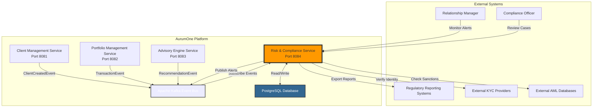
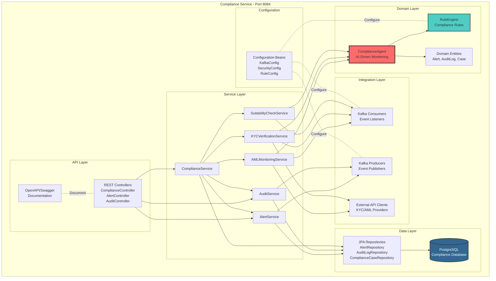
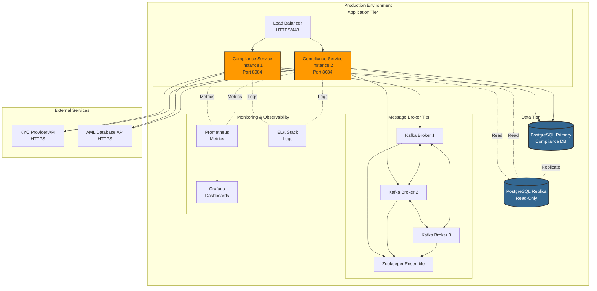
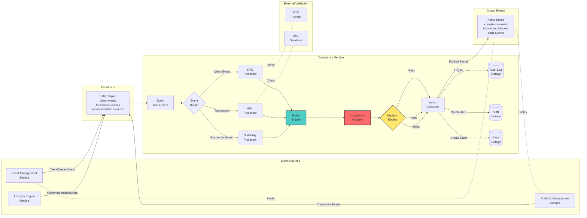
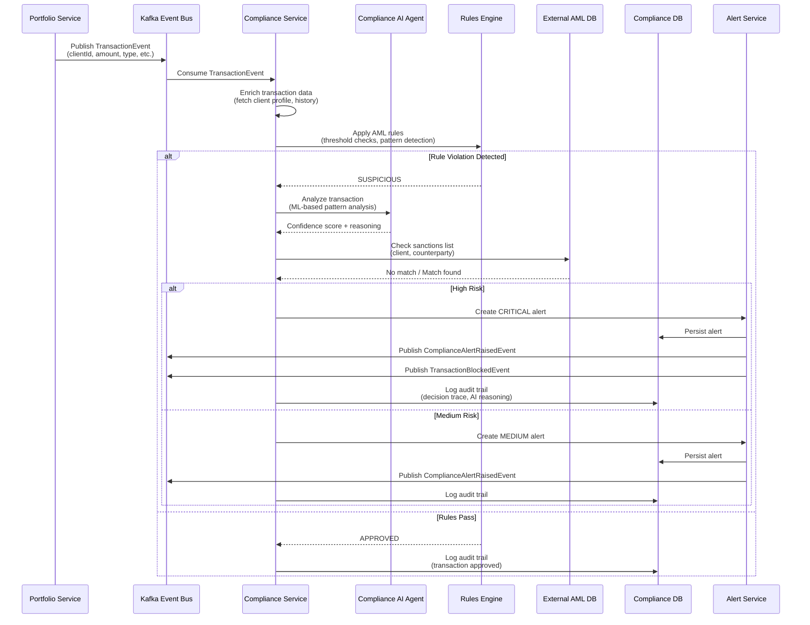
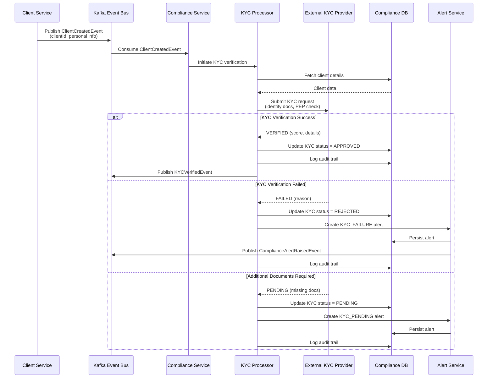
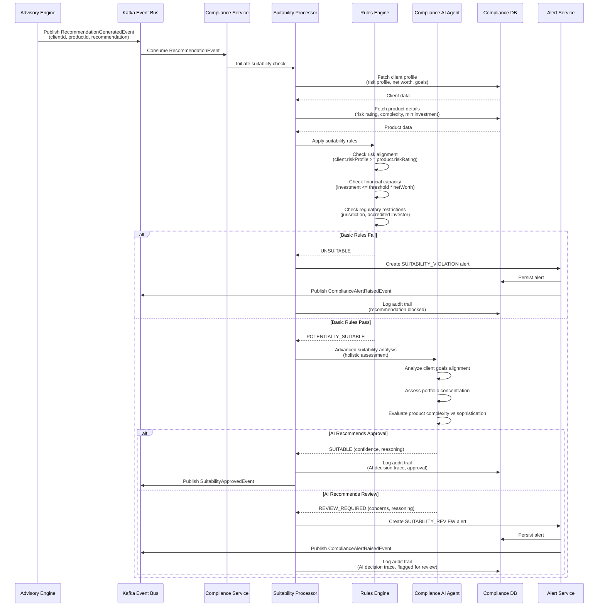
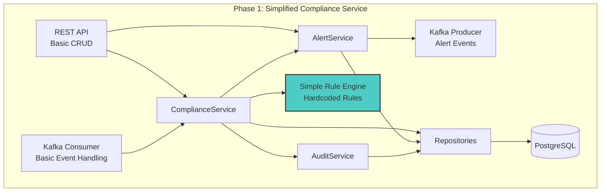

# Risk & Compliance Microservice - Architecture Plan

## Executive Summary

The Risk & Compliance microservice is a critical component of the AurumOne HNI Wealth Management Platform that ensures regulatory compliance, monitors transactions for suspicious activities, and maintains audit trails. This service implements Anti-Money Laundering (AML) monitoring, Know Your Customer (KYC) verification, FATCA/CRS compliance, suitability checks, and comprehensive audit logging.

**Key Architectural Decisions:**
- **Event-Driven Architecture**: Leverages Apache Kafka for asynchronous monitoring of transactions and recommendations
- **Microservices Pattern**: Independently deployable service following Domain-Driven Design principles
- **Real-time Monitoring**: Continuous surveillance of financial activities with immediate alert generation
- **Audit-First Design**: Comprehensive logging of all compliance-related decisions and actions
- **Rule Engine Pattern**: Flexible, configurable compliance rules for different regulatory frameworks

**Technology Stack:**
- Spring Boot 3.2.0 (Java 17)
- PostgreSQL for persistence
- Apache Kafka for event streaming
- OpenAPI/Swagger for API documentation

---

## System Context

### System Context Diagram



### Context Overview

The Risk & Compliance microservice operates at the intersection of regulatory requirements and business operations. It:

1. **Monitors Platform Activities**: Subscribes to events from client-management, portfolio-management, and advisory-engine services
2. **Enforces Regulatory Rules**: Applies AML, KYC, FATCA, CRS, and suitability rules
3. **Generates Alerts**: Creates compliance alerts for suspicious activities or rule violations
4. **Maintains Audit Trails**: Records all compliance decisions, actions, and AI reasoning
5. **Integrates with External Systems**: Connects to external KYC providers and AML databases for verification

### External Actors

- **Relationship Managers**: Monitor compliance alerts for their clients
- **Compliance Officers**: Review and resolve compliance cases
- **Regulatory Systems**: Receive compliance reports for regulatory filing
- **External KYC/AML Providers**: Third-party verification and screening services

---

## Architecture Overview

The Risk & Compliance microservice follows a **layered architecture** with clear separation of concerns:

**Architectural Patterns:**
1. **Event-Driven Architecture**: Reactive monitoring of platform events
2. **Domain-Driven Design**: Compliance domain encapsulated in bounded context
3. **CQRS (Command Query Responsibility Segregation)**: Separate models for compliance checks and audit queries
4. **Rule Engine Pattern**: Externalized business rules for regulatory compliance
5. **Saga Pattern**: Distributed transaction coordination for blocking transactions

**Core Design Principles:**
- **Separation of Concerns**: Clear boundaries between layers
- **Dependency Inversion**: Abstractions at service boundaries
- **Event Sourcing**: Complete audit trail through event logging
- **Idempotency**: Safe retry of compliance checks
- **Fail-Safe Defaults**: Conservative approach to ambiguous cases

---

## Component Architecture

### Component Diagram



### Component Responsibilities

#### 1. **API Layer**
- **REST Controllers**: Expose RESTful endpoints for compliance operations
  - `ComplianceController`: Initiate manual compliance checks, retrieve compliance status
  - `AlertController`: Query and manage compliance alerts
  - `AuditController`: Query audit logs and compliance reports
- **OpenAPI/Swagger**: Auto-generated API documentation

#### 2. **Service Layer**
- **ComplianceService**: Orchestrates compliance workflows
- **AMLMonitoringService**: Anti-Money Laundering transaction monitoring
- **KYCVerificationService**: Know Your Customer verification and updates
- **SuitabilityCheckService**: Investment suitability assessments
- **AlertService**: Alert lifecycle management (create, update, resolve)
- **AuditService**: Comprehensive audit trail logging

#### 3. **Domain Layer**
- **ComplianceAgent**: AI-driven compliance monitoring agent
  - Analyzes transactions for suspicious patterns
  - Validates recommendations against suitability rules
  - Makes decisions: block_transaction, raise_alert, generate_audit_log
- **RuleEngine**: Configurable compliance rule execution
  - AML rules (transaction thresholds, patterns)
  - KYC rules (verification requirements)
  - FATCA/CRS rules (reporting thresholds)
  - Suitability rules (risk alignment)
- **Domain Entities**: Core compliance domain models

#### 4. **Integration Layer**
- **Kafka Consumers**: Listen to platform events
  - ClientCreatedEvent → Trigger KYC verification
  - TransactionEvent → AML monitoring
  - RecommendationGeneratedEvent → Suitability check
- **Kafka Producers**: Publish compliance events
  - ComplianceAlertRaisedEvent
  - TransactionBlockedEvent
  - AuditLogCreatedEvent
- **External API Clients**: Integrate with third-party providers

#### 5. **Data Layer**
- **JPA Repositories**: Data access abstraction
- **PostgreSQL Database**: Persistent storage for alerts, audit logs, cases

---

## Deployment Architecture

### Deployment Diagram



### Deployment Strategy

#### Container Configuration
- **Base Image**: openjdk:17-jdk-slim
- **Resource Allocation**:
  - CPU: 2 cores (minimum), 4 cores (recommended)
  - Memory: 2GB (minimum), 4GB (recommended)
- **Environment Variables**:
  - DATABASE_URL, DATABASE_USER, DATABASE_PASSWORD
  - KAFKA_BOOTSTRAP_SERVERS
  - EXTERNAL_KYC_API_KEY, EXTERNAL_AML_API_KEY
- **Health Checks**: Spring Actuator endpoints (/actuator/health)

#### High Availability
- **Multi-Instance Deployment**: Minimum 2 instances behind load balancer
- **Horizontal Pod Autoscaling**: Scale based on CPU (70%) and custom metrics (alert processing rate)
- **Database Replication**: Primary-Replica setup for read scalability
- **Kafka Cluster**: 3-broker cluster for fault tolerance

#### Network Configuration
- **Service Port**: 8084 (internal), 443 (external via load balancer)
- **Database Port**: 5432 (internal network only)
- **Kafka Port**: 9092 (internal network only)
- **Security Groups**: Restrict access to internal network

---

## Data Flow

### Data Flow Diagram



### Data Flow Explanation

#### 1. **Event Ingestion**
- Platform services publish domain events to Kafka topics
- Compliance service consumers subscribe to relevant topics
- Events are consumed in real-time for immediate processing

#### 2. **Event Routing**
- Event Router classifies incoming events by type
- Routes to appropriate processor:
  - ClientCreatedEvent → KYC Processor
  - TransactionEvent → AML Processor
  - RecommendationGeneratedEvent → Suitability Processor

#### 3. **Compliance Processing**
Each processor follows a consistent workflow:
1. **Enrich Event Data**: Fetch additional context from database
2. **Apply Rules**: Execute regulatory rules via Rules Engine
3. **AI Analysis**: Compliance AI Agent performs advanced pattern detection
4. **External Validation**: Call external KYC/AML providers if needed
5. **Decision Making**: Determine action (Pass, Alert, Block)

#### 4. **Action Execution**
Based on decision:
- **Pass**: Log to audit trail, no further action
- **Alert**: Create compliance alert, assign to compliance officer, publish alert event
- **Block**: Block transaction, create high-priority alert, publish block event, notify relevant services

#### 5. **Data Persistence**
- **Audit Log**: Every compliance check, decision, and action (immutable)
- **Alert Storage**: Active and historical alerts (mutable status)
- **Case Storage**: Compliance cases requiring investigation (workflow tracking)

#### 6. **Event Publication**
- Publish compliance events back to Kafka for downstream consumption
- Other services react to compliance decisions (e.g., portfolio service blocks transaction)

### Data Transformation

**Input Events**:
```
ClientCreatedEvent → KYC Verification Request
TransactionEvent → AML Monitoring Request
RecommendationGeneratedEvent → Suitability Check Request
```

**Output Events**:
```
ComplianceAlertRaisedEvent → Notify compliance officers
TransactionBlockedEvent → Prevent transaction execution
AuditLogCreatedEvent → Regulatory reporting
```

---

## Key Workflows

### Sequence Diagram 1: AML Transaction Monitoring



#### Workflow Explanation: AML Transaction Monitoring

**Trigger**: TransactionEvent published by Portfolio Management Service

**Steps**:
1. **Event Consumption**: Compliance service receives transaction event
2. **Data Enrichment**: Fetch client profile, transaction history, risk profile
3. **Rule Evaluation**: Apply AML rules
   - Transaction amount thresholds (e.g., >$10,000 flagged)
   - Frequency patterns (e.g., structured transactions)
   - Geographic risk (high-risk jurisdictions)
   - Account behavior changes
4. **AI Analysis**: Machine learning model analyzes transaction patterns
   - Historical behavior comparison
   - Anomaly detection
   - Confidence scoring
5. **External Verification**: Check sanctions lists (OFAC, UN, EU)
6. **Decision Making**:
   - **High Risk**: Block transaction immediately, create critical alert
   - **Medium Risk**: Allow transaction with alert for review
   - **Low Risk**: Approve and log
7. **Audit Logging**: Record complete decision trace with AI reasoning

**NFR Considerations**:
- **Performance**: Process within 500ms for real-time blocking
- **Reliability**: Fail-safe default (block if uncertain)
- **Auditability**: Complete trace of decision logic

---

### Sequence Diagram 2: KYC Verification Workflow



#### Workflow Explanation: KYC Verification

**Trigger**: ClientCreatedEvent published by Client Management Service

**Steps**:
1. **Event Consumption**: New client registration detected
2. **Data Retrieval**: Fetch complete client profile and documentation
3. **External Verification**: Submit to KYC provider
   - Identity verification (government ID, biometrics)
   - PEP (Politically Exposed Person) screening
   - Adverse media check
   - Address verification
4. **Decision Handling**:
   - **Verified**: Update status, publish success event
   - **Failed**: Reject client, create alert, notify relationship manager
   - **Pending**: Request additional documents, create notification
5. **Audit Logging**: Record verification attempt and results

**NFR Considerations**:
- **Reliability**: Retry logic for external API failures
- **Security**: Encrypt PII data in transit and at rest
- **Compliance**: Maintain complete audit trail for regulatory inspection

---

### Sequence Diagram 3: Investment Suitability Check



#### Workflow Explanation: Investment Suitability Check

**Trigger**: RecommendationGeneratedEvent published by Advisory Engine

**Steps**:
1. **Event Consumption**: New investment recommendation detected
2. **Data Enrichment**: Fetch client profile and product details
3. **Rule-Based Checks**:
   - Risk alignment: Client risk profile ≥ Product risk rating
   - Financial capacity: Investment amount ≤ X% of net worth
   - Regulatory compliance: Accredited investor requirements
   - Jurisdiction restrictions: Product availability in client's region
4. **AI-Based Analysis** (if rules pass):
   - Goal alignment assessment
   - Portfolio diversification analysis
   - Product complexity vs. client sophistication
   - Concentration risk evaluation
5. **Decision Making**:
   - **Unsuitable**: Block recommendation, create alert
   - **Suitable**: Approve with audit log
   - **Review Required**: Flag for manual review by relationship manager
6. **Audit Logging**: Record complete decision trace including AI reasoning

**NFR Considerations**:
- **Compliance**: MiFID II suitability requirements
- **Transparency**: Explainable AI decisions
- **Auditability**: Complete recommendation trace

---

## Phased Development

Given the complexity of the Risk & Compliance microservice, we recommend a **phased implementation approach**:

### Phase 1: Initial Implementation (MVP)

**Timeline**: 6-8 weeks

**Scope**: Core compliance functionality with simplified rule engine

#### Phase 1 Architecture Simplifications



#### Phase 1 Features

**Included**:
- ✅ Basic AML monitoring (simple threshold rules)
- ✅ KYC status tracking (manual verification workflow)
- ✅ Simple suitability checks (risk profile matching)
- ✅ Alert creation and management
- ✅ Basic audit logging
- ✅ Kafka event consumption and publishing
- ✅ REST APIs for CRUD operations
- ✅ PostgreSQL persistence
- ✅ OpenAPI/Swagger documentation

**Excluded** (deferred to Phase 2):
- ❌ AI-driven Compliance Agent
- ❌ External KYC/AML provider integration
- ❌ Advanced pattern detection
- ❌ FATCA/CRS automated reporting
- ❌ Complex rule engine with rule management UI
- ❌ Machine learning-based anomaly detection

#### Phase 1 Rule Examples

**AML Rules (Hardcoded)**:
```
Rule 1: Transaction amount > $10,000 → Create MEDIUM alert
Rule 2: Daily transaction count > 5 → Create LOW alert
Rule 3: Transaction amount > $50,000 → Create HIGH alert + Manual review
```

**Suitability Rules (Hardcoded)**:
```
Rule 1: client.riskProfile < product.riskRating → BLOCK
Rule 2: investmentAmount > 20% * client.netWorth → REVIEW_REQUIRED
Rule 3: product.jurisdiction != client.jurisdiction → BLOCK
```

---

### Phase 2: Final Architecture (Full Features)

**Timeline**: 12-16 weeks (from project start)

**Scope**: Complete compliance platform with AI agent and external integrations

#### Phase 2 Enhancements

**New Components**:
- 🔥 **Compliance AI Agent**: ML-based pattern detection and anomaly detection
- 🔥 **Advanced Rule Engine**: Configurable rules with UI for rule management
- 🔥 **External Integrations**: KYC providers (e.g., Jumio, Onfido), AML databases (e.g., World-Check)
- 🔥 **FATCA/CRS Module**: Automated compliance and reporting
- 🔥 **Case Management**: Workflow for compliance case investigation
- 🔥 **Regulatory Reporting**: Automated report generation for regulators
- 🔥 **Advanced Analytics**: Compliance dashboards and metrics

#### Phase 2 Architecture (Complete)

Refer to the Component Architecture diagram above for the complete Phase 2 architecture.

#### Phase 2 Features

**AI/ML Capabilities**:
- Transaction pattern analysis
- Behavioral anomaly detection
- Risk scoring models
- Explainable AI decisions

**External Integrations**:
- KYC provider APIs (identity verification, PEP screening)
- AML database APIs (sanctions lists, adverse media)
- Regulatory reporting APIs (FIU, SEC, etc.)

**Advanced Functionality**:
- Dynamic rule configuration
- Compliance case workflows
- Automated regulatory reporting
- Advanced audit queries and analytics

---

### Migration Path: Phase 1 → Phase 2

**Step 1: Data Model Extensions** (Week 9-10)
- Add tables for compliance cases, rule configurations
- Migrate existing alerts to new schema
- No downtime required (backward compatible)

**Step 2: Rule Engine Upgrade** (Week 10-12)
- Deploy configurable rule engine
- Migrate hardcoded rules to rule database
- A/B test new engine alongside old rules
- Gradual cutover

**Step 3: AI Agent Integration** (Week 12-14)
- Deploy AI agent as separate module
- Run in shadow mode (parallel to existing logic)
- Compare decisions and tune model
- Enable for production traffic

**Step 4: External Integrations** (Week 14-15)
- Integrate KYC and AML providers
- Fallback to manual verification on API failures
- Monitor integration health

**Step 5: FATCA/CRS Module** (Week 15-16)
- Deploy reporting module
- Backfill historical data
- Enable automated reporting

**Step 6: Case Management** (Week 16)
- Deploy case workflow engine
- Migrate existing alerts to cases where applicable

**Rollback Strategy**:
- Feature flags for each Phase 2 component
- Database schema is backward compatible
- Ability to disable AI agent and fall back to rule-based logic

---

## Non-Functional Requirements Analysis

### Scalability

**Current Load Estimates**:
- **Transaction Events**: ~1,000 events/hour (~0.3/second)
- **Recommendation Events**: ~100 events/hour
- **Client Events**: ~50 events/hour
- **REST API Calls**: ~500 requests/hour

**Scalability Strategies**:

1. **Horizontal Scaling**:
   - Stateless service design enables easy horizontal scaling
   - Kafka consumer groups distribute event processing across instances
   - Add instances based on CPU/memory metrics or event lag

2. **Database Optimization**:
   - Read replicas for audit log queries (read-heavy workload)
   - Partitioning strategy for audit logs (by date)
   - Archival strategy for old alerts and audit logs

3. **Kafka Partitioning**:
   - Partition events by clientId for parallel processing
   - Multiple consumer instances process different partitions
   - Scale consumers independently

4. **Caching Strategy**:
   - Cache client profiles, risk profiles (Redis/Caffeine)
   - Cache product risk ratings
   - Cache rule configurations
   - TTL: 5-15 minutes

**Growth Projections**:
- **Current**: 2 service instances handle load
- **Year 1**: 4 instances (expected 5x growth in client base)
- **Year 3**: 8-10 instances (10x growth)

**Scalability Metrics**:
- Event processing latency < 500ms (p95)
- API response time < 200ms (p95)
- Kafka consumer lag < 100 messages

---

### Performance

**Performance Requirements**:

1. **Real-Time Processing**:
   - AML checks must complete within 500ms to enable real-time blocking
   - Suitability checks < 1 second
   - KYC verification initiation < 200ms

2. **API Response Times**:
   - Alert queries: < 200ms (p95)
   - Audit log queries: < 500ms (p95)
   - Compliance status check: < 100ms (p95)

3. **Throughput**:
   - Handle 10 transaction events/second (peak)
   - Process 1,000+ audit log writes/hour

**Performance Optimization Strategies**:

1. **Database Indexing**:
   ```sql
   -- Alert queries
   CREATE INDEX idx_alert_client ON compliance_alert(client_id, created_at DESC);
   CREATE INDEX idx_alert_status ON compliance_alert(status, severity);
   
   -- Audit log queries
   CREATE INDEX idx_audit_entity ON audit_log(entity_type, entity_id, timestamp DESC);
   CREATE INDEX idx_audit_time ON audit_log(timestamp DESC);
   ```

2. **Async Processing**:
   - Non-critical operations (audit logging, notification) processed asynchronously
   - Critical path (transaction blocking) synchronous

3. **Connection Pooling**:
   - Database connection pool: 20-50 connections
   - External API connection pool: 10 connections per provider

4. **Query Optimization**:
   - Pagination for large result sets
   - Projection queries (fetch only needed columns)
   - Avoid N+1 queries with JPA fetch strategies

**Performance Monitoring**:
- Micrometer metrics to Prometheus
- Custom metrics: event processing time, rule evaluation time, external API latency
- Alerting on p95 latency > thresholds

---

### Security

**Security Requirements**:

The Risk & Compliance service handles highly sensitive data (PII, financial transactions, regulatory decisions). Security is paramount.

**Security Measures**:

1. **Authentication & Authorization**:
   - OAuth 2.0 / JWT for API authentication
   - Role-based access control (RBAC):
     - COMPLIANCE_OFFICER: Full access to alerts, cases, audit logs
     - RELATIONSHIP_MANAGER: Read-only access to client alerts
     - SYSTEM_SERVICE: Service-to-service authentication for internal APIs
   - Service account authentication for Kafka and database

2. **Data Encryption**:
   - **In Transit**: TLS 1.3 for all external communication
   - **At Rest**: PostgreSQL transparent data encryption (TDE)
   - **Field-Level**: Encrypt PII fields (SSN, passport numbers) using application-level encryption

3. **PII Protection**:
   - Data masking in logs (redact sensitive fields)
   - Audit log access restricted to authorized personnel
   - Data retention policies (GDPR compliance: right to be forgotten)

4. **API Security**:
   - Rate limiting (100 requests/minute per client)
   - Input validation and sanitization
   - OWASP Top 10 compliance
   - CORS configuration for frontend access

5. **Secrets Management**:
   - External API keys stored in vault (HashiCorp Vault / AWS Secrets Manager)
   - Database credentials rotated regularly
   - No hardcoded secrets in code

6. **Network Security**:
   - Internal services accessible only within VPC
   - Kafka accessible only from authorized services
   - Database firewall rules (whitelist service IPs)

7. **Compliance-Specific Security**:
   - Immutable audit logs (append-only)
   - Segregation of duties (compliance officers cannot modify audit logs)
   - Multi-level approval for high-risk actions

**Security Monitoring**:
- Failed authentication attempts → Alert
- Unusual data access patterns → Alert
- External API anomalies → Alert
- Security audit logs separate from business audit logs

---

### Reliability

**Reliability Requirements**:
- **Availability**: 99.9% uptime (< 9 hours downtime/year)
- **Data Durability**: 99.999% (no data loss tolerance)
- **Disaster Recovery**: RPO < 1 hour, RTO < 4 hours

**Reliability Strategies**:

1. **High Availability**:
   - Multi-instance deployment (minimum 2 instances)
   - Load balancer health checks
   - Auto-restart on failure
   - No single point of failure

2. **Database Resilience**:
   - Primary-Replica PostgreSQL setup
   - Automated failover (pg_auto_failover / Patroni)
   - Daily automated backups
   - Point-in-time recovery capability

3. **Kafka Resilience**:
   - 3-broker Kafka cluster (replication factor = 3)
   - Consumer group rebalancing on failure
   - Idempotent event processing (handle duplicates)

4. **Retry Logic**:
   - Exponential backoff for external API calls
   - Circuit breaker pattern for external services (Resilience4j)
   - Dead letter queue for failed events

5. **Graceful Degradation**:
   - If external KYC provider down → Fall back to manual verification
   - If AI agent fails → Fall back to rule-based logic
   - If database replica down → Query primary (performance degradation)

6. **Monitoring & Alerting**:
   - Health check endpoints (/actuator/health)
   - Liveness and readiness probes (Kubernetes)
   - Alerts on:
     - Service down
     - Kafka consumer lag > threshold
     - Database connection failures
     - External API errors > 5%

**Failure Scenarios & Mitigation**:

| Failure Scenario | Impact | Mitigation |
|------------------|--------|------------|
| Service instance crash | Reduced capacity | Auto-restart, load balancer redirects to healthy instance |
| Database primary failure | Service disruption | Auto-failover to replica (< 30 seconds), potential data loss mitigated by WAL |
| Kafka broker failure | Event processing delay | Kafka rebalances, other brokers handle load |
| External KYC API down | KYC verification blocked | Circuit breaker opens, fall back to manual verification |
| Network partition | Service isolation | Timeout configurations, health checks detect and restart |

---

### Maintainability

**Maintainability Goals**:
- Ease of understanding for new developers
- Simple debugging and troubleshooting
- Flexible configuration
- Ease of testing

**Maintainability Strategies**:

1. **Code Quality**:
   - Follow Spring Boot best practices
   - Clean architecture (separation of concerns)
   - Comprehensive JavaDoc for complex logic
   - Consistent naming conventions
   - Code reviews mandatory

2. **Testing**:
   - **Unit Tests**: 80%+ coverage (service layer, rule engine)
   - **Integration Tests**: REST API, Kafka consumers, database repositories
   - **Contract Tests**: Kafka event schemas, REST API contracts
   - **End-to-End Tests**: Critical compliance workflows

3. **Logging & Debugging**:
   - Structured logging (JSON format)
   - Correlation IDs for distributed tracing
   - Log levels: DEBUG (dev), INFO (prod)
   - Sensitive data redacted from logs

4. **Configuration Management**:
   - Externalized configuration (application.properties, environment variables)
   - Spring Profiles (dev, test, prod)
   - Feature flags for new functionality
   - Rule engine configuration in database (Phase 2)

5. **Documentation**:
   - OpenAPI/Swagger for API documentation
   - Architecture decision records (ADR)
   - Runbooks for operational tasks
   - Compliance rule documentation

6. **Observability**:
   - Prometheus metrics (custom business metrics)
   - Distributed tracing (Jaeger / Zipkin)
   - Centralized logging (ELK stack)
   - Grafana dashboards for compliance metrics

7. **Versioning & Deployment**:
   - Semantic versioning
   - Blue-green deployment for zero downtime
   - Database migration scripts (Flyway / Liquibase)
   - Rollback procedures documented

**Developer Experience**:
- Local development setup documented (README)
- Docker Compose for local dependencies (Kafka, PostgreSQL)
- Postman collection for API testing
- IntelliJ run configurations provided

---

## Risks and Mitigations

| Risk | Likelihood | Impact | Mitigation |
|------|-----------|--------|------------|
| **External API Downtime** | Medium | High | Circuit breaker pattern, fallback to manual processes, SLA monitoring |
| **Regulatory Rule Changes** | High | Medium | Configurable rule engine (Phase 2), rapid deployment process, compliance team involvement |
| **False Positives** | High | Medium | AI agent tuning, confidence thresholds, human-in-the-loop review |
| **Performance Degradation** | Medium | High | Horizontal scaling, caching, database optimization, performance testing |
| **Data Loss** | Low | Critical | Database replication, automated backups, immutable audit logs |
| **Security Breach** | Low | Critical | Defense in depth, encryption, access controls, security audits |
| **Kafka Consumer Lag** | Medium | Medium | Monitoring and alerting, auto-scaling consumers, partition rebalancing |
| **AI Model Drift** | Medium | Medium | Model monitoring, A/B testing, regular retraining, human oversight |
| **Incomplete Audit Trail** | Low | High | Event sourcing pattern, database constraints, regular audit log validation |
| **Integration Complexity** | Medium | Medium | Phased rollout, extensive integration testing, API versioning |

**Risk Management Process**:
1. **Weekly Risk Review**: Compliance team reviews alerts and false positive rates
2. **Monthly Performance Review**: Review latency, throughput, and error rates
3. **Quarterly Security Audit**: External security assessment
4. **Regulatory Monitoring**: Continuous monitoring of regulatory changes

---

## Technology Stack Recommendations

### Backend Framework
- **Spring Boot 3.2.0**: Industry-standard, mature ecosystem, excellent Kafka integration
- **Java 17**: LTS version, modern language features, strong typing

### Database
- **PostgreSQL 14+**: ACID compliance, JSON support, excellent performance, replication

### Message Broker
- **Apache Kafka**: Event streaming, high throughput, fault-tolerant, industry standard

### API Documentation
- **SpringDoc OpenAPI 3**: Auto-generated Swagger UI, spec-compliant

### Testing
- **JUnit 5**: Unit testing
- **Testcontainers**: Integration testing with real PostgreSQL and Kafka
- **MockMVC**: REST API testing
- **Mockito**: Mocking framework

### Monitoring & Observability
- **Spring Boot Actuator**: Health checks, metrics
- **Micrometer**: Metrics abstraction
- **Prometheus**: Metrics storage
- **Grafana**: Dashboards and alerting
- **ELK Stack**: Centralized logging

### Security
- **Spring Security**: Authentication and authorization
- **OAuth 2.0 / JWT**: Token-based authentication
- **Jasypt**: Encryption for sensitive properties

### External Libraries
- **Lombok**: Reduce boilerplate code
- **MapStruct**: DTO mapping
- **Resilience4j**: Circuit breaker, retry, rate limiter
- **Caffeine**: In-memory caching

### Development Tools
- **Maven**: Build tool
- **Docker**: Containerization
- **Docker Compose**: Local development environment

### External Services (Phase 2)
- **KYC Providers**: Jumio, Onfido, Trulioo
- **AML Databases**: Refinitiv World-Check, Dow Jones Risk & Compliance
- **Machine Learning**: TensorFlow / PyTorch (for AI agent)

---

## Next Steps

### For Implementation Teams

#### Backend Team
1. **Review Architecture**: Ensure understanding of all components and workflows
2. **Set Up Project Structure**:
   - Create Maven project with Spring Boot 3.2.0
   - Set up package structure (controller, service, domain, repository, config, dto)
   - Configure dependencies (Spring Web, JPA, Kafka, PostgreSQL, OpenAPI)
3. **Implement Phase 1 Core Components**:
   - Domain entities (Alert, AuditLog, ComplianceCase)
   - JPA repositories
   - Service layer (ComplianceService, AlertService, AuditService)
   - REST controllers
4. **Implement Event Processing**:
   - Kafka configuration
   - Event consumers (TransactionEvent, RecommendationEvent, ClientEvent)
   - Event publishers (ComplianceAlertRaisedEvent)
5. **Implement Simple Rule Engine**:
   - Hardcoded AML rules (transaction thresholds)
   - Hardcoded suitability rules (risk profile matching)
6. **Configuration**:
   - application.properties (database, Kafka, port 8084)
   - Security configuration
   - OpenAPI configuration

#### DevOps Team
1. **Set Up Infrastructure**:
   - PostgreSQL database (compliance schema)
   - Kafka topics (compliance-events, alerts, audit-logs)
   - Docker image build pipeline
2. **Deploy Initial Environment**:
   - Development environment
   - CI/CD pipeline (GitHub Actions / Jenkins)
   - Monitoring setup (Prometheus, Grafana)

#### Compliance Team
1. **Define Compliance Rules**:
   - Document AML thresholds and patterns
   - Define KYC verification requirements
   - Specify suitability check criteria
   - Review FATCA/CRS requirements
2. **Review Workflows**:
   - Validate alert handling processes
   - Define escalation procedures
   - Review audit trail requirements

### Timeline (Phase 1)

| Week | Milestone |
|------|-----------|
| 1-2 | Project setup, infrastructure provisioning |
| 3-4 | Core domain entities, repositories, basic services |
| 5-6 | REST API implementation, Kafka event consumers |
| 7 | Simple rule engine, alert generation |
| 8 | Testing, documentation, deployment to dev |

### Success Criteria

**Phase 1 Complete When**:
- ✅ Service runs on port 8084
- ✅ Consumes events from Kafka (transactions, recommendations, clients)
- ✅ Publishes compliance alerts to Kafka
- ✅ Basic AML monitoring with threshold rules
- ✅ KYC status tracking
- ✅ Suitability checks for recommendations
- ✅ Alert CRUD APIs functional
- ✅ Audit logging operational
- ✅ OpenAPI documentation accessible
- ✅ Integration tests passing (>70% coverage)
- ✅ Deployed to dev environment

---

## Appendix: API Specifications (Phase 1)

### REST Endpoints

#### Compliance API

```
POST   /api/v1/compliance/check/aml
POST   /api/v1/compliance/check/kyc/{clientId}
POST   /api/v1/compliance/check/suitability
GET    /api/v1/compliance/status/{clientId}
```

#### Alert API

```
GET    /api/v1/alerts
GET    /api/v1/alerts/{alertId}
POST   /api/v1/alerts/{alertId}/resolve
GET    /api/v1/alerts/client/{clientId}
GET    /api/v1/alerts/severity/{severity}
```

#### Audit API

```
GET    /api/v1/audit/logs
GET    /api/v1/audit/logs/client/{clientId}
GET    /api/v1/audit/logs/entity/{entityType}/{entityId}
GET    /api/v1/audit/export
```

### Kafka Topics

#### Consumed Topics
- `client-events`: ClientCreatedEvent, ClientUpdatedEvent
- `transaction-events`: TransactionEvent
- `recommendation-events`: RecommendationGeneratedEvent

#### Published Topics
- `compliance-alerts`: ComplianceAlertRaisedEvent
- `compliance-actions`: TransactionBlockedEvent, KYCVerifiedEvent
- `audit-events`: AuditLogCreatedEvent

---

## Summary

This architecture document provides a comprehensive blueprint for implementing the Risk & Compliance microservice for the AurumOne HNI Wealth Management Platform. The design emphasizes:

- **Regulatory Compliance**: Complete coverage of AML, KYC, FATCA, CRS, and suitability requirements
- **Event-Driven Architecture**: Reactive, scalable monitoring of platform activities
- **Audit-First Design**: Complete traceability for regulatory inspection
- **Phased Delivery**: Pragmatic MVP approach with clear path to full features
- **Non-Functional Excellence**: Scalability, performance, security, reliability, maintainability

The proposed architecture aligns with the existing microservices ecosystem, follows established patterns from client-management, portfolio-management, and advisory-engine services, and provides a solid foundation for future enhancements.

**Implementation teams should use this document as the authoritative reference for all architectural decisions during the development of the Risk & Compliance microservice.**
