# Product Catalog Microservice - Architecture Plan

## Executive Summary

The **Product Catalog Microservice** is a critical component of the AurumOne HNI Wealth Management Platform, responsible for managing investment products including Equity, Bonds, Funds, PMS, AIF, and Structured Products. This service provides centralized product information, risk ratings, and suitability criteria to support personalized investment advisory and compliance with regulatory requirements.

**Technology Stack**: Spring Boot 3.2.0, Java 17, PostgreSQL, Apache Kafka, Docker  
**Port**: 8084  
**Bounded Context**: Product Catalog (Domain-Driven Design)

The architecture follows the established microservices pattern with a layered architecture (Controller → Service → Repository), event-driven communication, and RESTful API design.

---

## System Context

### System Context Diagram

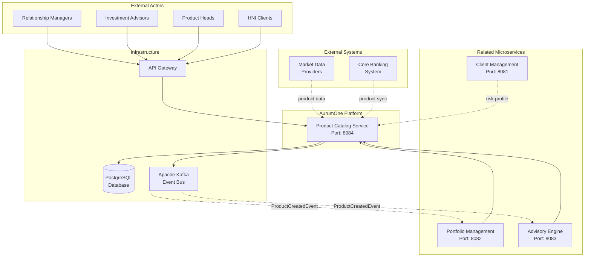

### Explanation

**Overview**: The Product Catalog Service acts as the central repository for all investment products in the AurumOne platform. It serves as the single source of truth for product information, risk ratings, and suitability criteria.

**Key Components**:
- **Product Catalog Service**: Core microservice managing product lifecycle
- **PostgreSQL Database**: Persistent storage for product data
- **Apache Kafka**: Event bus for publishing product-related events
- **API Gateway**: Entry point for all external requests

**External Actors**:
- **Relationship Managers**: Create and manage product offerings for clients
- **Investment Advisors**: Query products based on client suitability
- **Product Heads**: Maintain product catalog and update risk ratings
- **HNI Clients**: View available products through advisory interfaces

**Relationships**:
- **Advisory Engine** queries products for generating recommendations
- **Portfolio Management** uses product data for portfolio construction
- **Client Management** provides client risk profiles for suitability matching
- **Market Data Providers** supply real-time product information
- **Core Banking** syncs product availability and terms

**Design Decisions**:
1. **Microservice Isolation**: Product catalog is isolated to allow independent scaling and updates
2. **Event-Driven**: Publishes ProductCreatedEvent to notify dependent services
3. **API-First**: RESTful APIs enable easy integration with all platform components
4. **Single Source of Truth**: Centralized product data prevents inconsistencies

**NFR Considerations**:
- **Scalability**: Stateless design allows horizontal scaling
- **Performance**: Database indexing on product type and risk rating for fast queries
- **Security**: OAuth2/OIDC authentication, RBAC for product management
- **Reliability**: PostgreSQL ACID guarantees, event replay capability
- **Maintainability**: Clean architecture, standard patterns, comprehensive API documentation

---

## Architecture Overview

The Product Catalog Service follows a **3-tier layered architecture** with **Domain-Driven Design** principles:

1. **Presentation Layer** (Controller): RESTful API endpoints with OpenAPI/Swagger documentation
2. **Business Logic Layer** (Service): Product management, suitability calculation, event publishing
3. **Data Access Layer** (Repository): JPA-based database operations

**Architectural Patterns**:
- **Microservices Architecture**: Independent deployment and scaling
- **Event-Driven Architecture**: Asynchronous communication via Kafka
- **Repository Pattern**: Abstraction over data access
- **DTO Pattern**: Request/Response objects separate from domain entities
- **Domain-Driven Design**: Product aggregate with value objects (Money)

**Communication Patterns**:
- **Synchronous**: REST APIs for CRUD operations
- **Asynchronous**: Kafka events for domain events

---

## Component Architecture

### Component Diagram

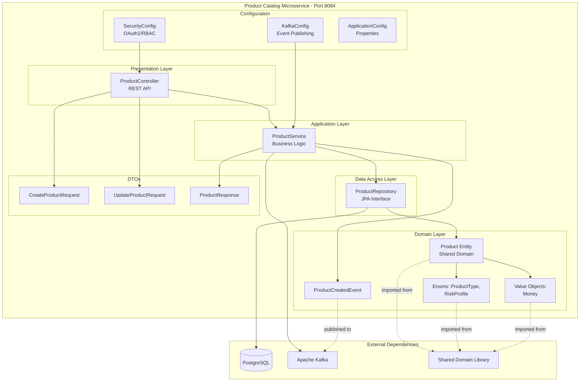

### Component Responsibilities

#### 1. ProductController (Presentation Layer)
**Responsibility**: Handle HTTP requests, validate input, return responses
- Expose RESTful endpoints for product operations
- Request validation using Jakarta Validation
- HTTP status code management
- OpenAPI/Swagger documentation
- Exception handling and error responses

**Key Endpoints**:
- `POST /api/v1/products` - Create product
- `GET /api/v1/products/{productId}` - Get product by ID
- `GET /api/v1/products` - List products with filtering
- `PUT /api/v1/products/{productId}` - Update product
- `DELETE /api/v1/products/{productId}` - Soft delete product
- `GET /api/v1/products/suitable` - Get suitable products for client

#### 2. ProductService (Business Logic Layer)
**Responsibility**: Business logic, orchestration, event publishing
- Product lifecycle management (create, update, deactivate)
- Suitability calculation based on risk profile and minimum investment
- Data transformation (Entity ↔ DTO)
- Event publishing to Kafka
- Transaction management
- Business rule enforcement

**Business Rules**:
- Products must have valid risk rating (1-10)
- Minimum investment must be positive
- Product deactivation is soft delete (isActive = false)
- Suitability matches client risk profile and investment capacity

#### 3. ProductRepository (Data Access Layer)
**Responsibility**: Database operations, custom queries
- CRUD operations via JpaRepository
- Custom query methods for filtering
- Suitability-based product search
- Active/inactive product filtering

**Custom Queries**:
- Find by product type
- Find by risk rating range
- Find suitable products (risk profile + min investment)
- Find active products only

#### 4. Domain Layer
**Responsibility**: Core domain model (shared library)
- **Product Entity**: Core domain object with persistence annotations
- **ProductType Enum**: Product categories (Equity, Bond, Fund, PMS, AIF, StructuredProduct)
- **RiskProfile Enum**: Risk categories (Conservative, Moderate, Aggressive)
- **Money Value Object**: Embedded value object for amounts with currency
- **ProductCreatedEvent**: Domain event for product creation

#### 5. Configuration Layer
**Responsibility**: Spring Boot configuration
- **SecurityConfig**: OAuth2, RBAC, endpoint security
- **KafkaConfig**: Producer configuration, serialization
- **Application Properties**: Database, Kafka, server configuration

#### 6. DTOs (Data Transfer Objects)
**Responsibility**: API contracts, data validation
- **CreateProductRequest**: Validated input for product creation
- **UpdateProductRequest**: Validated input for product updates
- **ProductResponse**: Standardized API response format

### Design Decisions

1. **Shared Domain Library**: Product entity lives in shared/domain to enable consistent domain model across microservices
2. **Soft Delete Pattern**: Products are deactivated (isActive=false) rather than deleted to maintain audit trail
3. **Money Value Object**: Encapsulates amount and currency as a cohesive unit
4. **Event Publishing**: ProductCreatedEvent enables eventual consistency and loose coupling
5. **DTO Pattern**: Separates API contract from domain model, allowing independent evolution
6. **JPA Repository**: Leverages Spring Data JPA for reduced boilerplate code
7. **Transaction Management**: @Transactional ensures data consistency

### NFR Considerations

**Scalability**:
- Stateless service design enables horizontal scaling
- Database connection pooling for efficient resource usage
- Pagination support for large result sets

**Performance**:
- Database indexes on productType, riskRating, isActive
- Query optimization using JPA Specifications
- Caching candidates: product catalog (Redis integration point)

**Security**:
- Spring Security with OAuth2/OIDC
- RBAC for product management operations
- Input validation to prevent injection attacks
- Sensitive data encryption at rest

**Reliability**:
- ACID transactions via PostgreSQL
- Event replay capability through Kafka
- Health checks via Spring Actuator
- Circuit breaker pattern (future enhancement)

**Maintainability**:
- Clean layered architecture
- Single Responsibility Principle per component
- Comprehensive API documentation with Swagger
- Lombok reduces boilerplate code
- Consistent naming conventions

---

## Deployment Architecture

### Deployment Diagram

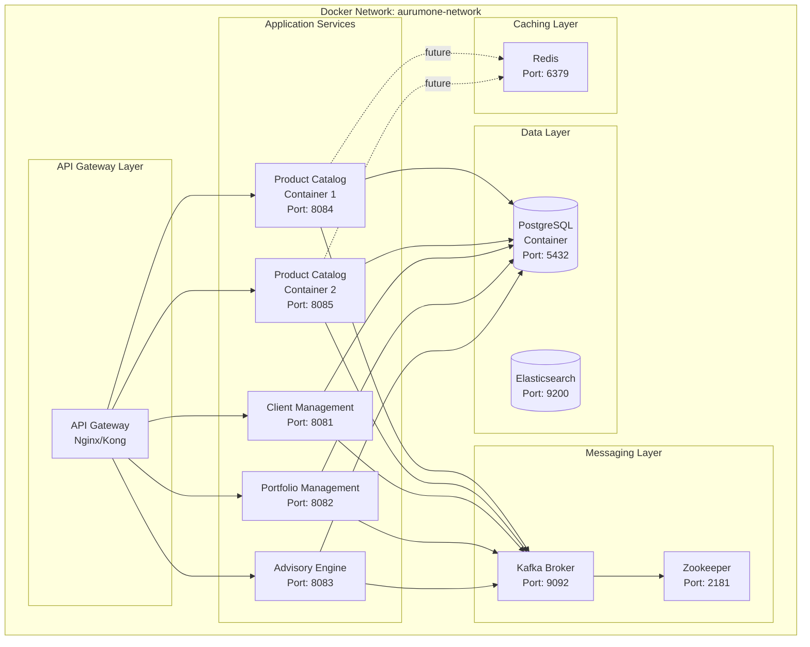

### Deployment Environments

#### Development Environment
```yaml
Environment: Local Docker Compose
Services:
  - product-catalog-service: 1 instance (port 8084)
  - postgres: 1 instance (port 5432)
  - kafka: 1 broker (port 9092)
  - zookeeper: 1 instance (port 2181)
  - redis: 1 instance (port 6379)

Resource Allocation:
  - product-catalog: 512MB RAM, 1 CPU
  - postgres: 512MB RAM
  - kafka: 1GB RAM
  
Database: Single PostgreSQL instance with `aurumone` database
```

#### Staging Environment
```yaml
Environment: Kubernetes Cluster
Services:
  - product-catalog-service: 2 replicas
  - postgres: 1 primary + 1 replica
  - kafka: 3 brokers
  - redis: 1 instance with persistence

Resource Allocation:
  - product-catalog: 1GB RAM, 1 CPU per pod
  - postgres: 2GB RAM, 2 CPU
  - kafka: 2GB RAM per broker
  
Load Balancing: Kubernetes Service (ClusterIP)
Ingress: Nginx Ingress Controller
```

#### Production Environment
```yaml
Environment: Kubernetes Cluster (Multi-AZ)
Services:
  - product-catalog-service: 3+ replicas (auto-scaling)
  - postgres: 1 primary + 2 replicas (read replicas)
  - kafka: 5 brokers (replication factor 3)
  - redis: Redis Cluster (3 masters, 3 replicas)

Resource Allocation:
  - product-catalog: 2GB RAM, 2 CPU per pod
  - postgres: 8GB RAM, 4 CPU (primary)
  - kafka: 4GB RAM, 2 CPU per broker
  
High Availability:
  - Multi-AZ deployment
  - Auto-scaling (HPA) based on CPU/memory
  - Database connection pooling
  - Circuit breakers
  - Health checks and liveness probes

Monitoring:
  - Prometheus + Grafana
  - ELK Stack for log aggregation
  - Distributed tracing (Jaeger/Zipkin)
```

### Container Specification (Dockerfile)

```dockerfile
# Stage 1: Build shared domain library
FROM maven:3.8-openjdk-17-slim AS build
WORKDIR /app

# Build shared domain
COPY backend/shared/domain/pom.xml /app/shared/domain/
COPY backend/shared/domain/src /app/shared/domain/src
RUN cd /app/shared/domain && mvn clean install

# Stage 2: Build product-catalog service
COPY backend/services/product-catalog/pom.xml .
RUN mvn dependency:go-offline

COPY backend/services/product-catalog/src ./src
RUN mvn clean package -DskipTests

# Stage 3: Runtime
FROM openjdk:17-jdk-slim
WORKDIR /app
COPY --from=build /app/target/*.jar app.jar

EXPOSE 8084
ENTRYPOINT ["java", "-jar", "app.jar"]
```

### Network Architecture

**Security Zones**:
1. **DMZ Zone**: API Gateway (exposed to internet)
2. **Application Zone**: Microservices (internal network only)
3. **Data Zone**: Databases, message queues (no external access)

**Network Policies**:
- API Gateway → Product Catalog: HTTPS (TLS 1.3)
- Product Catalog → PostgreSQL: TCP (internal network)
- Product Catalog → Kafka: TCP (internal network)
- Inter-service communication: Internal DNS resolution

### Deployment Strategy

**Rolling Update**:
- Zero-downtime deployments
- Update 1 pod at a time
- Health check validation before proceeding
- Automatic rollback on failure

**Blue-Green Deployment** (Production):
- Maintain two identical environments
- Switch traffic after validation
- Quick rollback capability

### Infrastructure Components

1. **Container Orchestration**: Kubernetes
2. **Service Mesh** (future): Istio for traffic management, observability
3. **Configuration Management**: Kubernetes ConfigMaps, Secrets
4. **Storage**: Persistent Volumes for database data
5. **Networking**: Kubernetes Services, Ingress

### Explanation

The deployment architecture follows a **containerized microservices** approach with Docker and Kubernetes:

**Design Decisions**:
1. **Docker Containers**: Ensures consistency across environments
2. **Kubernetes Orchestration**: Auto-scaling, self-healing, rolling updates
3. **Multi-stage Build**: Reduces final image size, improves security
4. **Shared Network**: All services in same Docker network for internal communication
5. **External Volumes**: Database data persists across container restarts

**NFR Considerations**:
- **Scalability**: Kubernetes HPA enables automatic scaling based on load
- **Performance**: Multi-instance deployment with load balancing
- **Security**: Network isolation, encrypted communication, secret management
- **Reliability**: Multi-AZ deployment, health checks, auto-restart
- **Maintainability**: Infrastructure as Code, GitOps practices

**Trade-offs**:
- Increased infrastructure complexity vs. improved scalability
- Resource overhead of container orchestration vs. operational benefits

---

## Data Flow

### Data Flow Diagram

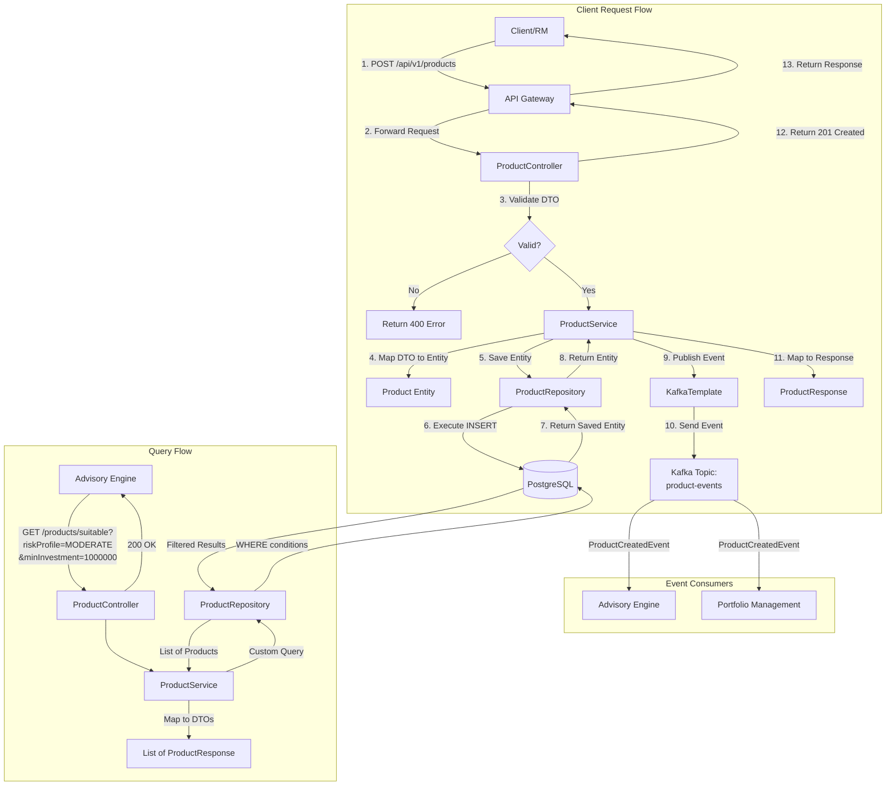

### Data Flow Steps

#### 1. Product Creation Flow
1. **Request Initiation**: RM/Product Head sends POST request to create product
2. **API Gateway**: Routes request to Product Catalog service
3. **Controller Layer**: Validates CreateProductRequest DTO
4. **Service Layer**: 
   - Maps DTO to Product entity
   - Sets default values (isActive = true)
   - Saves to database via repository
5. **Repository Layer**: Executes JPA INSERT operation
6. **Database**: Persists product with auto-generated UUID
7. **Event Publishing**: 
   - Creates ProductCreatedEvent
   - Publishes to Kafka topic `product-events`
8. **Response**: Returns ProductResponse with 201 Created status

#### 2. Suitability Query Flow
1. **Request Initiation**: Advisory Engine queries suitable products
2. **Query Parameters**: Risk profile, minimum investment amount
3. **Service Layer**: Applies suitability logic
   - Filter by minRiskProfile <= client risk profile
   - Filter by minInvestment <= client investment capacity
   - Filter by isActive = true
4. **Repository Layer**: Custom query with WHERE conditions
5. **Database**: Returns filtered product list
6. **Response**: List of suitable products as DTOs

#### 3. Product Update Flow
1. **Request Initiation**: Product Head sends PUT request
2. **Controller**: Validates UpdateProductRequest
3. **Service Layer**:
   - Fetches existing product by ID
   - Updates mutable fields
   - Triggers @PreUpdate hook (updatedAt timestamp)
4. **Repository**: Executes UPDATE operation
5. **Database**: Updates product record
6. **Response**: Returns updated ProductResponse

#### 4. Soft Delete Flow
1. **Request Initiation**: DELETE /products/{id}
2. **Service Layer**: Sets isActive = false (soft delete)
3. **Repository**: Updates record
4. **Event**: Could publish ProductDeactivatedEvent (future enhancement)

### Data Transformation Points

| Stage | Input | Output | Transformation |
|-------|-------|--------|----------------|
| Controller → Service | CreateProductRequest | Product Entity | DTO to Domain |
| Service → Repository | Product Entity | Product Entity | No transformation |
| Repository → Database | Product Entity | SQL INSERT | JPA ORM mapping |
| Service → Controller | Product Entity | ProductResponse | Domain to DTO |
| Service → Kafka | Product Entity | ProductCreatedEvent | Domain to Event |

### Data Validation Points

1. **Input Validation** (Controller):
   - @NotNull, @Valid annotations
   - Jakarta Validation constraints
   - Product type enum validation

2. **Business Validation** (Service):
   - Risk rating in range [1-10]
   - Minimum investment > 0
   - Product code uniqueness

3. **Database Constraints**:
   - UUID primary key
   - Unique product code
   - NOT NULL constraints
   - Enum type validation

### Explanation

**Data Handling Strategy**:
- **Immutable Events**: ProductCreatedEvent is immutable for audit trail
- **Embedded Value Objects**: Money is embedded in Product entity
- **Timestamp Management**: Automatic creation/update timestamps via JPA lifecycle hooks
- **Soft Delete Pattern**: Maintains data history, supports audit requirements

**NFR Considerations**:
- **Performance**: Indexed queries on product type, risk rating for fast retrieval
- **Security**: Input validation prevents SQL injection, XSS attacks
- **Reliability**: Transactional boundaries ensure data consistency
- **Maintainability**: Clear separation of DTOs and domain entities

---

## Key Workflows

### Sequence Diagram: Create Product Workflow

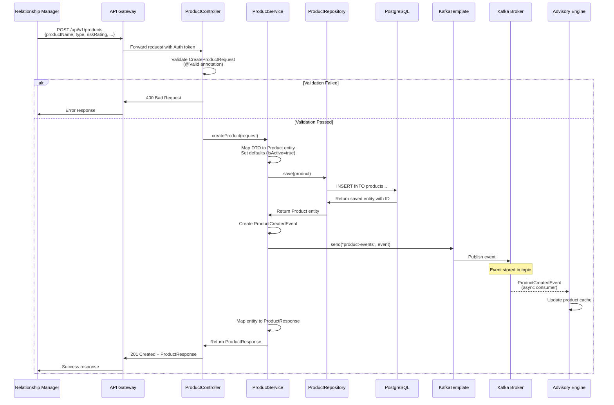

### Sequence Diagram: Get Suitable Products Workflow

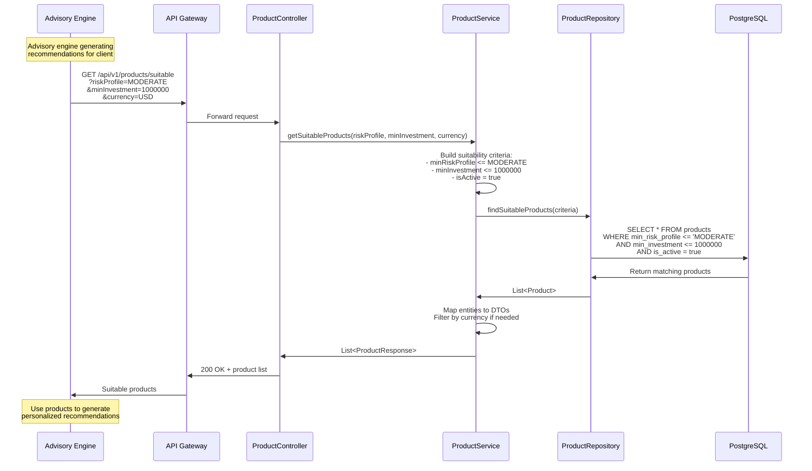

### Sequence Diagram: Update Product Workflow

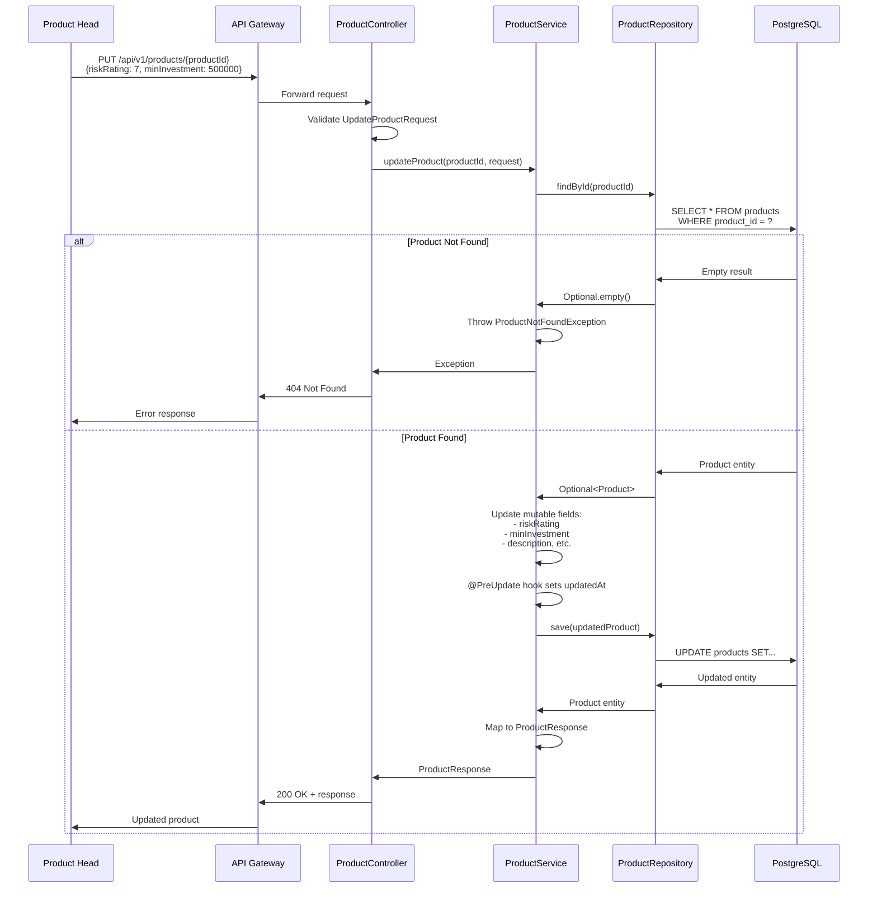

### Sequence Diagram: Product Deactivation (Soft Delete) Workflow

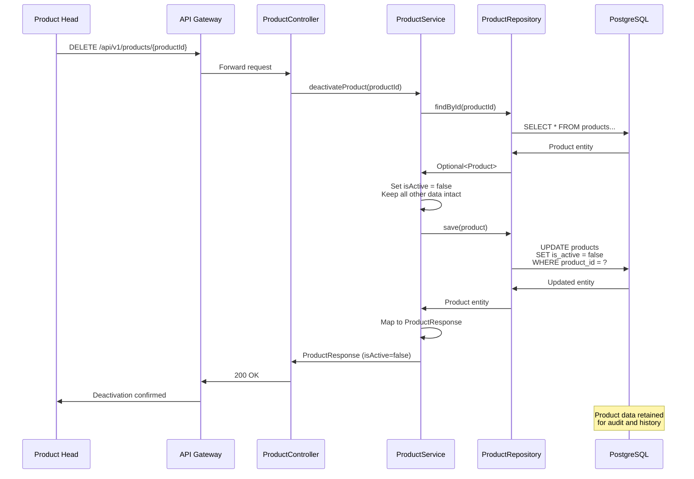

### Explanation

**Key User Journeys**:

1. **Product Creation**: Product Head adds new investment product to catalog
2. **Suitability Search**: Advisory Engine finds products matching client profile
3. **Product Update**: Product Head modifies product parameters (risk rating, minimum investment)
4. **Product Deactivation**: Product Head removes product from active catalog (soft delete)

**Design Decisions**:
1. **Synchronous API Calls**: REST APIs for CRUD operations ensure immediate consistency
2. **Asynchronous Events**: ProductCreatedEvent enables loose coupling with consumers
3. **Soft Delete**: Preserves audit trail and historical data
4. **DTO Validation**: Early validation reduces database load
5. **Error Handling**: Appropriate HTTP status codes for different error scenarios

**NFR Considerations**:
- **Performance**: Database queries optimized with indexes
- **Security**: Authentication/authorization at API Gateway
- **Reliability**: Transaction boundaries ensure atomic operations
- **Maintainability**: Clear separation of concerns, standard patterns

---

## Additional Diagrams

### Entity Relationship Diagram (ERD)

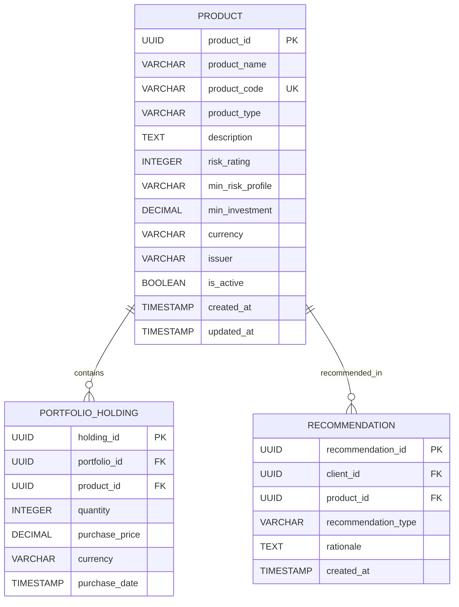

**Explanation**: The Product entity is the core of the Product Catalog domain. It has relationships with:
- **Portfolio Holdings**: Products held in client portfolios
- **Recommendations**: Products recommended to clients

Value object **Money** is embedded in Product entity (minInvestment + currency).

### State Diagram: Product Lifecycle

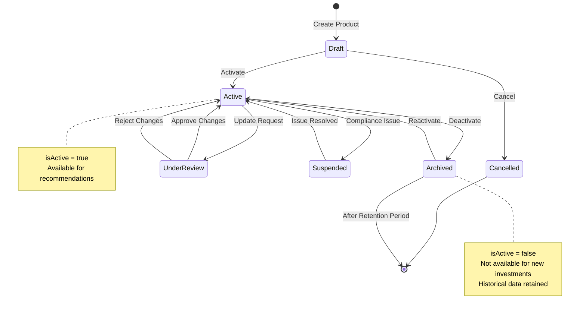

**Explanation**: 
- **Initial Phase**: Products are created in Draft state (simplified: directly Active)
- **Active State**: Products available for recommendations and investments
- **Suspended State**: Temporary hold due to compliance or market issues (future enhancement)
- **Archived State**: Soft delete (isActive = false)
- **Final Phase**: Data purged after retention period (compliance requirement)

### Integration Architecture Diagram

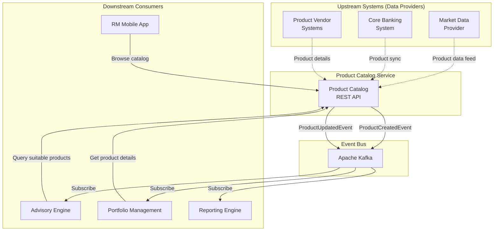

**Explanation**: The Product Catalog acts as a data hub:
- **Inbound**: Receives product data from market providers, core banking (future)
- **Outbound**: Publishes events and serves API requests
- **Synchronous**: REST APIs for real-time queries
- **Asynchronous**: Kafka events for state changes

---

## Phased Development

Given the complexity of the Product Catalog service and its integration with multiple systems, we'll use a phased approach:

### Phase 1: Initial Implementation (MVP)

**Scope**: Core product catalog functionality with basic suitability matching

#### Phase 1 Features:
✅ **Core CRUD Operations**:
- Create product (POST /api/v1/products)
- Get product by ID (GET /api/v1/products/{id})
- List all products (GET /api/v1/products)
- Update product (PUT /api/v1/products/{id})
- Soft delete product (DELETE /api/v1/products/{id})

✅ **Basic Filtering**:
- Filter by product type
- Filter by risk rating

✅ **Simple Suitability**:
- Get suitable products by risk profile and minimum investment
- Basic logic: minRiskProfile <= clientRiskProfile AND minInvestment <= clientInvestment

✅ **Events**:
- ProductCreatedEvent only

✅ **Infrastructure**:
- Single PostgreSQL instance
- Single Kafka broker
- No caching
- Basic security (permitAll for initial testing)

✅ **Documentation**:
- OpenAPI/Swagger documentation
- Basic health checks

#### Phase 1 Limitations:
- No advanced filtering (issuer, currency, etc.)
- No pagination
- No caching layer
- No external integrations
- Basic error handling
- No comprehensive logging/monitoring

### Phase 2+: Final Architecture (Production-Ready)

**Scope**: Full-featured product catalog with advanced capabilities

#### Phase 2+ Additional Features:

✅ **Advanced Filtering**:
- Multi-criteria search (type + risk + issuer + currency)
- Full-text search on product name and description
- Date range filtering (created/updated)

✅ **Pagination & Sorting**:
- Page-based pagination
- Sort by multiple fields
- Configurable page size

✅ **Complex Suitability**:
- Jurisdiction-based suitability
- Client segment-specific products
- Time-based product availability
- Concentration limits

✅ **Caching Layer**:
- Redis for product catalog caching
- Cache invalidation on updates
- Cache-aside pattern
- TTL-based expiration

✅ **External Integrations**:
- Market data provider sync (daily/real-time)
- Core banking product sync
- Product vendor API integration
- Automated product updates

✅ **Additional Events**:
- ProductUpdatedEvent
- ProductDeactivatedEvent
- ProductReactivatedEvent

✅ **Enhanced Security**:
- OAuth2/OIDC integration
- RBAC for product management
- Audit logging for all changes
- Data encryption at rest

✅ **Observability**:
- Distributed tracing (Jaeger/Zipkin)
- Comprehensive metrics (Prometheus)
- Centralized logging (ELK stack)
- Custom business metrics

✅ **Resilience**:
- Circuit breakers for external calls
- Retry logic with exponential backoff
- Bulkhead pattern for resource isolation
- Graceful degradation

✅ **Performance Optimizations**:
- Database read replicas
- Query optimization and indexing
- Connection pooling
- Async processing for bulk operations

### Migration Path: Phase 1 → Phase 2+

#### Migration Strategy:
- **Blue-Green Deployment**: Run Phase 1 and Phase 2 in parallel
- **Feature Flags**: Gradually enable Phase 2 features
- **Data Migration**: No schema changes required
- **Rollback Plan**: Quick rollback to Phase 1 if issues arise

**Timeline**: 8-10 weeks for full Phase 2+ implementation

---

## Non-Functional Requirements Analysis

### Scalability

**Horizontal Scalability**:
- ✅ **Stateless Service**: No session state, can run multiple instances
- ✅ **Database Connection Pooling**: HikariCP for efficient connection management
- ✅ **Load Balancing**: Kubernetes Service or API Gateway distributes traffic
- ✅ **Shared-Nothing Architecture**: Each instance independent

**Vertical Scalability**:
- ✅ **Resource Configuration**: CPU/memory limits configurable per environment
- ✅ **JVM Tuning**: Heap size optimization based on workload

**Data Scalability**:
- ✅ **Database Indexing**: Indexes on product_type, risk_rating, is_active
- ✅ **Pagination**: Prevents loading large datasets
- ✅ **Read Replicas** (Phase 2): Offload read traffic from primary database

**Target Metrics**:
- Support 10,000+ products in catalog
- Handle 100+ concurrent requests
- Scale to 10+ instances in production

### Performance

**Response Time Targets**:
- GET single product: < 100ms
- GET product list (paginated): < 200ms
- POST create product: < 300ms
- GET suitable products: < 500ms

**Throughput Targets**:
- 1000+ requests per second per instance
- 10,000+ products searchable

**Optimization Strategies**:
1. **Database Optimization**:
   - Composite indexes: (is_active, product_type, risk_rating)
   - Query optimization with EXPLAIN ANALYZE
   - Connection pooling (pool size: 20-50)

2. **Caching** (Phase 2):
   - Redis cache for product catalog
   - Cache TTL: 5 minutes
   - Cache hit ratio target: > 80%

3. **JPA Optimization**:
   - Lazy loading for relationships
   - Fetch join for eager loading when needed
   - Batch inserts for bulk operations

### Security

**Authentication**:
- OAuth2/OIDC integration with identity provider
- JWT token validation
- Token expiration and refresh

**Authorization**:
- Role-Based Access Control (RBAC):
  - **PRODUCT_ADMIN**: Full CRUD access
  - **PRODUCT_VIEWER**: Read-only access
  - **ADVISOR**: Query suitable products
  - **SYSTEM**: Inter-service communication

**API Security**:
- HTTPS/TLS 1.3 for all external communication
- CSRF protection disabled (stateless API)
- Rate limiting (API Gateway level)

**Data Security**:
- Encryption at rest (PostgreSQL TDE or disk encryption)
- Encryption in transit (TLS)
- Sensitive data masking in logs

**Input Validation**:
- Jakarta Validation for DTOs
- SQL injection prevention (JPA parameterized queries)
- XSS prevention (input sanitization)

**Audit Logging**:
- All product creation/update/delete logged
- User identity captured in audit logs
- Tamper-proof audit trail
- Retention: 7 years (regulatory requirement)

### Reliability

**High Availability**:
- Multi-instance deployment (3+ instances in production)
- Health checks (liveness, readiness probes)
- Auto-restart on failure
- Multi-AZ deployment

**Fault Tolerance**:
- Database failover (primary + replicas)
- Kafka replication (replication factor 3)
- Circuit breaker for external dependencies (Phase 2)
- Graceful degradation

**Data Durability**:
- PostgreSQL ACID guarantees
- Database backups (daily full, hourly incremental)
- Point-in-time recovery capability
- Backup retention: 30 days

**Recovery Objectives**:
- **RTO (Recovery Time Objective)**: 15 minutes
- **RPO (Recovery Point Objective)**: 5 minutes
- **MTTR (Mean Time To Repair)**: 30 minutes

### Maintainability

**Code Quality**:
- Clean architecture (layered design)
- Single Responsibility Principle
- Dependency Injection
- Comprehensive unit tests (target: 80% coverage)
- Integration tests for critical paths

**Documentation**:
- OpenAPI/Swagger for API documentation
- Inline code comments for complex logic
- Architecture decision records (ADRs)
- Runbooks for operational procedures

**Logging**:
- Structured logging (JSON format)
- Correlation IDs for request tracing
- Log levels (DEBUG, INFO, WARN, ERROR)
- Centralized log aggregation (ELK stack)

**Deployment**:
- CI/CD pipeline (Jenkins, GitLab CI, GitHub Actions)
- Automated testing in pipeline
- Blue-green deployments
- Rollback capability

**Configuration Management**:
- Externalized configuration (application.properties)
- Environment-specific configs (dev, staging, prod)
- Secrets management (Kubernetes Secrets, Vault)

---

## Risks and Mitigations

| Risk | Impact | Probability | Mitigation Strategy |
|------|--------|-------------|---------------------|
| **Database Performance Degradation** | High | Medium | - Database indexing<br/>- Read replicas<br/>- Query optimization<br/>- Caching layer (Phase 2) |
| **Kafka Message Loss** | High | Low | - Kafka replication factor 3<br/>- Acknowledgment configuration<br/>- Event replay capability |
| **Security Breach** | High | Low | - Regular security audits<br/>- Dependency scanning<br/>- Penetration testing |
| **Data Inconsistency** | Medium | Medium | - Event sourcing pattern<br/>- Eventual consistency monitoring<br/>- Reconciliation jobs |
| **Service Downtime** | High | Low | - Multi-AZ deployment<br/>- Health checks and auto-restart<br/>- Disaster recovery plan |
| **API Breaking Changes** | Medium | Medium | - API versioning strategy<br/>- Backward compatibility testing<br/>- Deprecation policy |

---

## Technology Stack Recommendations

### Core Framework
- **Spring Boot 3.2.0**: Mature, production-ready, excellent ecosystem
- **Java 17**: LTS version, modern language features, performance improvements

### Database
- **PostgreSQL 15**: ACID compliance, JSON support, excellent performance, open-source

### Messaging
- **Apache Kafka**: High-throughput, fault-tolerant, event streaming platform

### API Documentation
- **SpringDoc OpenAPI**: Automatic OpenAPI 3.0 generation, Swagger UI integration

### Security
- **Spring Security**: Comprehensive security framework
- **OAuth2/OIDC**: Industry-standard authentication/authorization

### Monitoring & Observability
- **Spring Actuator**: Health checks, metrics endpoint
- **Micrometer + Prometheus**: Metrics collection and aggregation
- **Grafana**: Metrics visualization and dashboards

### Testing
- **JUnit 5**: Unit testing framework
- **Mockito**: Mocking framework
- **Testcontainers**: Integration testing with containers

### Build & Deployment
- **Maven**: Dependency management, build tool
- **Docker**: Containerization
- **Kubernetes**: Container orchestration

---

## Next Steps

### For Implementation Teams

#### Immediate Actions (Week 1)
1. ✅ **Repository Setup**:
   - Create `/backend/services/product-catalog` directory
   - Set up Maven project structure

2. ✅ **Development Environment**:
   - Update `docker-compose.yml` to include product-catalog service
   - Configure Kafka topics

3. ✅ **Shared Domain Dependencies**:
   - Verify Product entity in shared domain library
   - Create ProductCreatedEvent in shared domain

#### Phase 1 Implementation (Week 2-4)

4. ✅ **Core Service Development**:
   - Implement ProductCatalogApplication.java
   - Create ProductController with all CRUD endpoints
   - Implement ProductService with business logic
   - Create ProductRepository with custom queries

5. ✅ **DTO Layer**:
   - CreateProductRequest with validation annotations
   - UpdateProductRequest
   - ProductResponse

6. ✅ **Configuration**:
   - SecurityConfig (basic authentication)
   - KafkaConfig (event publishing)
   - application.properties for all environments

7. ✅ **Testing**:
   - Unit tests for ProductService
   - Integration tests for ProductController

8. ✅ **Documentation**:
   - OpenAPI/Swagger annotations
   - README with API examples

9. ✅ **Deployment**:
   - Dockerfile following established pattern
   - Kubernetes manifests

### Success Criteria

**Phase 1 Completion**:
- ✅ All CRUD endpoints functional
- ✅ ProductCreatedEvent published successfully
- ✅ Unit test coverage > 80%
- ✅ Swagger documentation complete
- ✅ Service deployed to dev environment

---

## Appendix

### API Endpoint Reference

| Method | Endpoint | Description | Response |
|--------|----------|-------------|----------|
| POST | /api/v1/products | Create new product | 201 + ProductResponse |
| GET | /api/v1/products/{id} | Get product by ID | 200 + ProductResponse |
| GET | /api/v1/products | List all products | 200 + List<ProductResponse> |
| PUT | /api/v1/products/{id} | Update product | 200 + ProductResponse |
| DELETE | /api/v1/products/{id} | Deactivate product | 200 + ProductResponse |
| GET | /api/v1/products/suitable | Get suitable products | 200 + List<ProductResponse> |

### Database Schema

```sql
CREATE TABLE products (
    product_id UUID PRIMARY KEY DEFAULT gen_random_uuid(),
    product_name VARCHAR(255) NOT NULL,
    product_code VARCHAR(50) UNIQUE,
    product_type VARCHAR(50) NOT NULL,
    description TEXT,
    risk_rating INTEGER CHECK (risk_rating BETWEEN 1 AND 10),
    min_risk_profile VARCHAR(50),
    min_investment DECIMAL(19, 2),
    currency VARCHAR(3),
    issuer VARCHAR(255),
    is_active BOOLEAN DEFAULT true,
    created_at TIMESTAMP DEFAULT CURRENT_TIMESTAMP,
    updated_at TIMESTAMP DEFAULT CURRENT_TIMESTAMP
);

CREATE INDEX idx_product_type ON products(product_type);
CREATE INDEX idx_risk_rating ON products(risk_rating);
CREATE INDEX idx_is_active ON products(is_active);
CREATE INDEX idx_composite_search ON products(is_active, product_type, risk_rating);
```

---

## Conclusion

The **Product Catalog Microservice** is designed as a robust, scalable, and maintainable component of the AurumOne HNI Wealth Management Platform. By following established microservices patterns, leveraging proven technologies (Spring Boot, PostgreSQL, Kafka), and addressing all non-functional requirements, this service will serve as the foundation for personalized investment advisory and portfolio management.

The phased development approach ensures rapid delivery of core functionality (Phase 1) while providing a clear roadmap for advanced features (Phase 2+).

**Key Takeaways**:
1. ✅ **Domain-Driven Design**: Product aggregate with value objects
2. ✅ **Event-Driven Architecture**: Asynchronous communication for loose coupling
3. ✅ **API-First Design**: RESTful APIs with comprehensive documentation
4. ✅ **Scalability**: Horizontal scaling, database optimization, caching
5. ✅ **Security**: OAuth2, RBAC, encryption, audit logging
6. ✅ **Reliability**: Multi-AZ deployment, health checks, disaster recovery
7. ✅ **Maintainability**: Clean architecture, comprehensive testing, observability

---

**Document Version**: 1.0  
**Last Updated**: 2026-01-13  
**Author**: Senior Cloud Architect  
**Status**: Approved for Implementation
